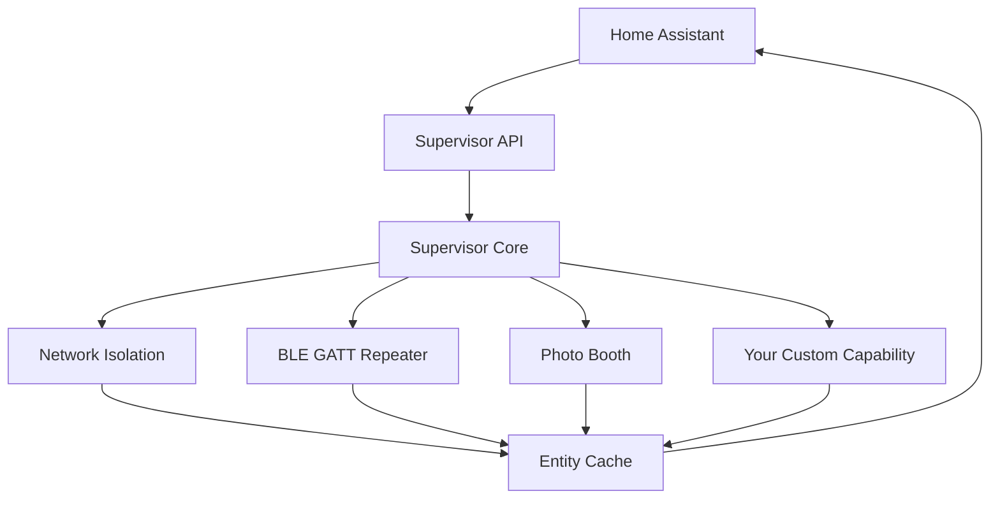

# Capability Development Guide

This guide walks you through creating custom capabilities for the PerimeterControl supervisor.

## Table of Contents

- [Overview](#overview)
- [Capability Architecture](#capability-architecture)
- [Development Setup](#development-setup)
- [Creating a Basic Capability](#creating-a-basic-capability)
- [Advanced Features](#advanced-features)
- [Testing Your Capability](#testing-your-capability)
- [Deployment](#deployment)
- [Best Practices](#best-practices)
- [Troubleshooting](#troubleshooting)

## Overview

Capabilities are pluggable modules that extend the PerimeterControl supervisor with specific functionality:

- **Network Isolation**: Manages device access control and traffic monitoring
- **BLE GATT Repeater**: Bridges Bluetooth Low Energy devices to Home Assistant
- **Photo Booth**: Captures photos/timelapses from cameras with motion detection
- **Your Custom Capability**: Whatever you want to build!

### What Capabilities Can Do

- **Entity Management**: Create and manage Home Assistant entities (sensors, buttons, etc.)
- **Action Handling**: Respond to user actions and API calls
- **Event Publishing**: Send real-time updates via WebSocket
- **Configuration Management**: Handle dynamic configuration changes
- **Health Monitoring**: Provide health status and diagnostics
- **Resource Management**: Request and manage system resources (CPU, memory, storage)

## Capability Architecture



### Key Components

1. **CapabilityModule Base Class**: Inherit from this for your capability
2. **Entity Cache**: Publishes entities to Home Assistant
3. **Config Management**: YAML-based configuration
4. **Event System**: Real-time event publishing
5. **Health Probes**: Monitoring and diagnostics

## Development Setup

### 1. Clone and Setup Environment

```bash
cd /path/to/PerimeterControl
python -m venv venv
source venv/bin/activate  # or venv\\Scripts\\activate on Windows
pip install -r requirements.txt
```

### 2. Create Development Workspace

```bash
mkdir remote_services/supervisor/capabilities/my_capability
cd remote_services/supervisor/capabilities/my_capability
touch __init__.py capability.py
```

### 3. Install Development Tools

```bash
pip install pytest pytest-asyncio pytest-mock black ruff mypy
```

## Creating a Basic Capability

### Step 1: Define the Capability Class

Create `remote_services/supervisor/capabilities/my_capability/capability.py`:

```python
"""
My Custom Capability - Example capability implementation.
"""

import logging
import asyncio
from typing import Any, Dict, List, Optional
from datetime import datetime

from ..base import CapabilityModule

logger = logging.getLogger(__name__)


class MyCustomCapability(CapabilityModule):
    \"\"\"
    Example custom capability that demonstrates:
    - Entity creation and management
    - Action handling
    - Configuration management
    - Health monitoring
    \"\"\"

    def __init__(self, cap_id: str, config: Dict[str, Any], entity_cache, emit_event):
        super().__init__(cap_id, config, entity_cache, emit_event)
        
        # Capability-specific state
        self._device_count = 0
        self._last_update = None
        self._monitoring_task: Optional[asyncio.Task] = None
        
        # Configuration with defaults
        self.update_interval = config.get('update_interval', 60)  # seconds
        self.max_devices = config.get('max_devices', 10)
        self.enable_alerts = config.get('enable_alerts', True)

    async def start(self) -> None:
        \"\"\"
        Start the capability - called when capability is deployed.
        \"\"\"
        logger.info("[%s] Starting My Custom Capability", self.cap_id)
        
        # Create initial entities
        await self._create_entities()
        
        # Start background monitoring
        self._monitoring_task = asyncio.create_task(self._monitoring_loop())
        
        logger.info("[%s] My Custom Capability started successfully", self.cap_id)

    async def stop(self) -> None:
        \"\"\"
        Stop the capability - called when capability is undeployed.
        \"\"\"
        logger.info("[%s] Stopping My Custom Capability", self.cap_id)
        
        # Cancel background tasks
        if self._monitoring_task:
            self._monitoring_task.cancel()
            try:
                await self._monitoring_task
            except asyncio.CancelledError:
                pass
        
        # Clear all entities from Home Assistant
        self.entity_cache.clear_capability_entities(self.cap_id)
        
        logger.info("[%s] My Custom Capability stopped", self.cap_id)

    def get_entities(self) -> List[Dict[str, Any]]:
        \"\"\"
        Return all entities managed by this capability.
        \"\"\"
        return list(self.entity_cache.get_by_capability(self.cap_id).values())

    def get_health_probe(self) -> Optional[Dict[str, Any]]:
        \"\"\"
        Return health check configuration for this capability.
        \"\"\"
        return {
            "type": "custom",
            "check": self._health_check,
            "timeout_sec": 10,
            "interval_sec": 30,
        }

    async def execute_action(self, action_id: str, params: Dict[str, Any]) -> Any:
        \"\"\"
        Execute capability-specific actions.
        \"\"\"
        logger.info("[%s] Executing action: %s with params: %s", self.cap_id, action_id, params)
        
        if action_id == "refresh":
            await self._refresh_data()
            return {"message": "Data refreshed successfully"}
        
        elif action_id == "add_device":
            device_name = params.get('name', f'Device {self._device_count + 1}')
            device_id = await self._add_device(device_name)
            return {"message": f"Added device: {device_name}", "device_id": device_id}
        
        elif action_id == "remove_device":
            device_id = params.get('device_id')
            if not device_id:
                raise ValueError("device_id parameter is required")
            success = await self._remove_device(device_id)
            return {"message": f"Removed device {device_id}", "success": success}
        
        elif action_id == "get_status":
            return await self._get_detailed_status()
        
        else:
            raise NotImplementedError(f"Unknown action: {action_id}")

    @staticmethod
    def validate_config(config: Dict[str, Any]) -> List[str]:
        \"\"\"
        Validate capability configuration and return list of errors.
        \"\"\"
        errors = []
        
        # Validate update interval
        update_interval = config.get('update_interval', 60)
        if not isinstance(update_interval, int) or update_interval < 1:
            errors.append("update_interval must be a positive integer")
        
        # Validate max devices
        max_devices = config.get('max_devices', 10)
        if not isinstance(max_devices, int) or max_devices < 1 or max_devices > 100:
            errors.append("max_devices must be between 1 and 100")
        
        # Validate enable_alerts
        enable_alerts = config.get('enable_alerts', True)
        if not isinstance(enable_alerts, bool):
            errors.append("enable_alerts must be a boolean")
        
        return errors

    # Private methods

    async def _create_entities(self) -> None:
        \"\"\"Create initial Home Assistant entities.\"\"\"
        
        # Main status sensor
        status_entity = {
            "id": f"{self.cap_id}:status",
            "type": "sensor",
            "friendly_name": "My Custom Capability Status",
            "capability": self.cap_id,
            "state": "initializing",
            "icon": "mdi:cog",
            "attributes": {
                "device_count": self._device_count,
                "last_update": None,
                "update_interval": self.update_interval,
            }
        }
        self._publish_entity(status_entity)
        
        # Device count sensor
        count_entity = {
            "id": f"{self.cap_id}:device_count",
            "type": "sensor", 
            "friendly_name": "Device Count",
            "capability": self.cap_id,
            "state": str(self._device_count),
            "icon": "mdi:counter",
            "attributes": {
                "max_devices": self.max_devices,
                "unit": "devices",
            }
        }
        self._publish_entity(count_entity)
        
        # Refresh button
        refresh_button = {
            "id": f"{self.cap_id}:refresh",
            "type": "button",
            "friendly_name": "Refresh Data",
            "capability": self.cap_id,
            "icon": "mdi:refresh",
            "attributes": {
                "action": "refresh"
            }
        }
        self._publish_entity(refresh_button)

    async def _monitoring_loop(self) -> None:
        \"\"\"Background monitoring loop.\"\"\"
        while True:
            try:
                await self._update_status()
                await asyncio.sleep(self.update_interval)
            except asyncio.CancelledError:
                break
            except Exception as e:
                logger.error("[%s] Error in monitoring loop: %s", self.cap_id, e)
                await asyncio.sleep(min(self.update_interval, 30))  # Backoff on error

    async def _update_status(self) -> None:
        \"\"\"Update status entity with current information.\"\"\"
        self._last_update = datetime.now()
        
        # Update main status entity
        status_entity = {
            "id": f"{self.cap_id}:status",
            "type": "sensor",
            "friendly_name": "My Custom Capability Status",
            "capability": self.cap_id,
            "state": "active",
            "icon": "mdi:cog",
            "attributes": {
                "device_count": self._device_count,
                "last_update": self._last_update.isoformat(),
                "update_interval": self.update_interval,
            }
        }
        self._publish_entity(status_entity)
        
        # Emit event for real-time updates
        await self.emit_event("status_updated", {
            "capability": self.cap_id,
            "device_count": self._device_count,
            "timestamp": self._last_update.isoformat()
        })

    async def _refresh_data(self) -> None:
        \"\"\"Manually refresh all data.\"\"\"
        logger.info("[%s] Refreshing data", self.cap_id)
        await self._update_status()
        
        # Refresh device count entity
        count_entity = {
            "id": f"{self.cap_id}:device_count",
            "type": "sensor",
            "friendly_name": "Device Count", 
            "capability": self.cap_id,
            "state": str(self._device_count),
            "icon": "mdi:counter",
            "attributes": {
                "max_devices": self.max_devices,
                "unit": "devices",
                "last_refreshed": datetime.now().isoformat(),
            }
        }
        self._publish_entity(count_entity)

    async def _add_device(self, device_name: str) -> str:
        \"\"\"Add a new device.\"\"\"
        if self._device_count >= self.max_devices:
            raise ValueError(f"Cannot add device: maximum of {self.max_devices} devices reached")
        
        self._device_count += 1
        device_id = f"device_{self._device_count}"
        
        # Create device entity
        device_entity = {
            "id": f"{self.cap_id}:device:{device_id}",
            "type": "binary_sensor",
            "friendly_name": device_name,
            "capability": self.cap_id,
            "state": "on",
            "device_class": "connectivity", 
            "icon": "mdi:devices",
            "attributes": {
                "device_id": device_id,
                "added_at": datetime.now().isoformat(),
            }
        }
        self._publish_entity(device_entity)
        
        # Update count
        await self._refresh_data()
        
        logger.info("[%s] Added device: %s (%s)", self.cap_id, device_name, device_id)
        return device_id

    async def _remove_device(self, device_id: str) -> bool:
        \"\"\"Remove a device.\"\"\"
        entity_id = f"{self.cap_id}:device:{device_id}"
        if entity_id not in self.entity_cache._entities:
            return False
        
        # Remove device entity
        self.entity_cache.remove_entity(entity_id)
        self._device_count = max(0, self._device_count - 1)
        
        # Update count
        await self._refresh_data()
        
        logger.info("[%s] Removed device: %s", self.cap_id, device_id)
        return True

    async def _get_detailed_status(self) -> Dict[str, Any]:
        \"\"\"Get detailed status information.\"\"\"
        return {
            "capability_id": self.cap_id,
            "status": "active",
            "device_count": self._device_count,
            "max_devices": self.max_devices,
            "update_interval": self.update_interval,
            "enable_alerts": self.enable_alerts,
            "last_update": self._last_update.isoformat() if self._last_update else None,
            "config": self.config,
        }

    async def _health_check(self) -> bool:
        \"\"\"Health check implementation.\"\"\"
        try:
            # Check if monitoring task is running
            if self._monitoring_task and self._monitoring_task.done():
                return False
            
            # Check if last update was recent (within 2x interval)
            if self._last_update:
                time_since_update = (datetime.now() - self._last_update).total_seconds()
                if time_since_update > (self.update_interval * 2):
                    return False
            
            return True
        except Exception:
            return False
```

### Step 2: Create __init__.py

Create `remote_services/supervisor/capabilities/my_capability/__init__.py`:

```python
\"\"\"
My Custom Capability module.
\"\"\"

from .capability import MyCustomCapability

__all__ = ["MyCustomCapability"]
```

### Step 3: Register the Capability

Add your capability to the supervisor's main.py registration:

```python
# In remote_services/supervisor/main.py in _register_capabilities():

try:
    from .capabilities.my_capability import MyCustomCapability
    supervisor.register_capability("my_capability", MyCustomCapability)
except ImportError as exc:
    logging.warning("Could not load my_capability module: %s", exc)
```

### Step 4: Create Configuration Descriptor

Create `service_descriptors/my_capability.yaml`:

```yaml
id: my_capability
name: My Custom Capability
version: 1.0.0
description: Example custom capability demonstrating entity management and actions
category: custom
author: Your Name

# Service configuration
port: null  # No web interface
access_mode: api_only

# Capability configuration
config:
  update_interval: 60
  max_devices: 10
  enable_alerts: true

# Actions available for this capability
actions:
  refresh:
    description: Manually refresh all data
    parameters: {}
  
  add_device:
    description: Add a new device
    parameters:
      name:
        type: string
        required: false
        description: Device name (auto-generated if not provided)
  
  remove_device:
    description: Remove a device by ID
    parameters:
      device_id:
        type: string
        required: true
        description: Device ID to remove
  
  get_status:
    description: Get detailed capability status
    parameters: {}

# Resource requirements
resources:
  cpu_cores: 0.1
  memory_mb: 64
  disk_mb: 10

# Dependencies
dependencies:
  - python3
  - asyncio

# Health check configuration
health_check:
  interval_sec: 30
  timeout_sec: 10
  retries: 3

# Documentation
documentation:
  setup_guide: "docs/capabilities/my-capability-setup.md"
  api_reference: "docs/capabilities/my-capability-api.md"
  troubleshooting: "docs/capabilities/my-capability-troubleshooting.md"
```

## Advanced Features

### Entity Management

```python
# Create different types of entities

# Sensor with measurements
temperature_entity = {
    "id": f"{self.cap_id}:temperature",
    "type": "sensor",
    "friendly_name": "Temperature",
    "capability": self.cap_id,
    "state": "23.5",
    "unit_of_measurement": "°C",
    "device_class": "temperature",
    "state_class": "measurement",  # For statistics
    "icon": "mdi:thermometer"
}

# Binary sensor with attributes
motion_entity = {
    "id": f"{self.cap_id}:motion",
    "type": "binary_sensor", 
    "friendly_name": "Motion Detected",
    "capability": self.cap_id,
    "state": "off",
    "device_class": "motion",
    "attributes": {
        "sensitivity": "high",
        "last_triggered": None
    }
}

# Button for actions  
action_button = {
    "id": f"{self.cap_id}:action_button",
    "type": "button",
    "friendly_name": "Execute Action",
    "capability": self.cap_id,
    "icon": "mdi:play",
    "attributes": {
        "action": "execute_custom_action"
    }
}

# Number input for configuration
threshold_number = {
    "id": f"{self.cap_id}:threshold",
    "type": "number",
    "friendly_name": "Alert Threshold", 
    "capability": self.cap_id,
    "state": "50",
    "attributes": {
        "min": 0,
        "max": 100,
        "step": 5,
        "unit_of_measurement": "%"
    }
}

# Publish all entities
for entity in [temperature_entity, motion_entity, action_button, threshold_number]:
    self._publish_entity(entity)
```

### Configuration Management

```python
async def update_config(self, new_config: Dict[str, Any]) -> None:
    \"\"\"Handle dynamic configuration updates.\"\"\"
    
    # Validate new configuration
    errors = self.validate_config(new_config)
    if errors:
        raise ValueError(f"Invalid configuration: {errors}")
    
    # Update configuration
    old_interval = self.update_interval
    self.config.update(new_config)
    self.update_interval = new_config.get('update_interval', self.update_interval)
    
    # Restart monitoring if interval changed
    if self.update_interval != old_interval and self._monitoring_task:
        self._monitoring_task.cancel()
        self._monitoring_task = asyncio.create_task(self._monitoring_loop())
    
    # Update entities with new config
    await self._refresh_data()
    
    logger.info("[%s] Configuration updated", self.cap_id)
```

### Event Publishing

```python
# Publish real-time events to Home Assistant
await self.emit_event("device_added", {
    "capability": self.cap_id,
    "device_id": device_id,
    "device_name": device_name,
    "timestamp": datetime.now().isoformat()
})

# Publish alerts
if self.enable_alerts and value > threshold:
    await self.emit_event("threshold_exceeded", {
        "capability": self.cap_id,
        "value": value,
        "threshold": threshold,
        "severity": "warning"
    })
```

### Resource Management

```python
def get_resource_requirements(self) -> Dict[str, Any]:
    \"\"\"Return resource requirements for this capability.\"\"\"
    return {
        "cpu_cores": 0.1 * self.max_devices,  # Scale with device count
        "memory_mb": 64 + (self._device_count * 8),
        "disk_mb": 10 + (self._device_count * 2),
        "network_bandwidth_kbps": 100 if self._device_count > 0 else 0,
    }
```

## Testing Your Capability

### Unit Tests

Create `tests/test_my_capability.py`:

```python
import pytest
from unittest.mock import Mock, AsyncMock

from remote_services.supervisor.capabilities.my_capability import MyCustomCapability


class TestMyCustomCapability:
    
    @pytest.fixture
    def capability(self):
        mock_entity_cache = Mock()
        mock_emit_event = AsyncMock()
        config = {
            "update_interval": 30,
            "max_devices": 5,
            "enable_alerts": True
        }
        
        return MyCustomCapability(
            cap_id="test_capability",
            config=config,
            entity_cache=mock_entity_cache,
            emit_event=mock_emit_event
        )
    
    @pytest.mark.asyncio
    async def test_start_capability(self, capability):
        await capability.start()
        
        assert capability._monitoring_task is not None
        assert not capability._monitoring_task.done()
        
        # Cleanup
        await capability.stop()
    
    @pytest.mark.asyncio
    async def test_add_device(self, capability):
        await capability.start()
        
        device_id = await capability._add_device("Test Device")
        
        assert device_id == "device_1"
        assert capability._device_count == 1
        
        await capability.stop()
    
    @pytest.mark.asyncio
    async def test_execute_refresh_action(self, capability):
        await capability.start()
        
        result = await capability.execute_action("refresh", {})
        
        assert result["message"] == "Data refreshed successfully"
        
        await capability.stop()
    
    def test_config_validation(self):
        # Valid config
        valid_config = {
            "update_interval": 60,
            "max_devices": 10,
            "enable_alerts": True
        }
        errors = MyCustomCapability.validate_config(valid_config)
        assert len(errors) == 0
        
        # Invalid config
        invalid_config = {
            "update_interval": -1,  # Invalid
            "max_devices": 200,     # Too high
            "enable_alerts": "yes"  # Wrong type
        }
        errors = MyCustomCapability.validate_config(invalid_config)
        assert len(errors) == 3
```

### Integration Tests

```python
@pytest.mark.integration
async def test_capability_with_supervisor():
    \"\"\"Test capability integration with supervisor.\"\"\"
    # This would test the capability in a real supervisor environment
    pass
```

### Run Tests

```bash
# Run all tests
pytest tests/test_my_capability.py

# Run with coverage
pytest --cov=remote_services.supervisor.capabilities.my_capability tests/test_my_capability.py

# Run specific test
pytest tests/test_my_capability.py::TestMyCustomCapability::test_add_device
```

## Deployment

### Local Testing

1. **Start Supervisor Locally**:
```bash
cd remote_services/supervisor
python -m supervisor --config /tmp/test_config --state /tmp/test_state --log-level DEBUG
```

2. **Deploy Capability**:
```bash
curl -X POST http://localhost:8080/api/v1/capabilities/my_capability/deploy \\
  -H "Content-Type: application/json" \\
  -d '{"config": {"update_interval": 30, "max_devices": 5}}'
```

3. **Test Actions**:
```bash
# Add device
curl -X POST http://localhost:8080/api/v1/capabilities/my_capability/actions/add_device \\
  -H "Content-Type: application/json" \\
  -d '{"name": "Test Device"}'

# Refresh data
curl -X POST http://localhost:8080/api/v1/capabilities/my_capability/actions/refresh
```

### Pi Device Deployment

1. **Add to Deployment Script**:
```bash
# In deploy.ps1 or deployer.py
# The capability will be automatically deployed when supervisor starts
```

2. **Deploy via Home Assistant**:
```yaml
# Use the HA integration to deploy
service: perimeter_control.deploy_capability
data:
  capability_id: my_capability
  config:
    update_interval: 60
    max_devices: 10
    enable_alerts: true
```

## Best Practices

### Code Organization

- **Single Responsibility**: Each capability should have one clear purpose
- **Error Handling**: Always handle exceptions gracefully
- **Logging**: Use structured logging with appropriate levels
- **Configuration**: Make behavior configurable, not hardcoded
- **Resource Cleanup**: Always clean up in the `stop()` method

### Entity Design

- **Meaningful IDs**: Use descriptive, unique entity IDs
- **Appropriate Types**: Choose the right entity type for your data
- **Rich Attributes**: Provide useful metadata in entity attributes
- **State Classes**: Use proper state classes for statistics
- **Icons**: Choose appropriate Material Design icons

### Performance

- **Async Operations**: Use async/await for I/O operations
- **Batch Updates**: Update multiple entities together when possible
- **Rate Limiting**: Don't flood Home Assistant with updates
- **Resource Monitoring**: Track and report resource usage

### Security

- **Input Validation**: Validate all action parameters
- **Configuration Validation**: Validate configuration thoroughly
- **Safe Defaults**: Use safe default values
- **Error Messages**: Don't expose sensitive information in errors

## Troubleshooting

### Common Issues

1. **Capability Not Loading**:
   - Check supervisor logs: `journalctl -u perimeter-supervisor -f`
   - Verify import path in `main.py`
   - Check for syntax errors in capability module

2. **Entities Not Appearing**:
   - Verify `_publish_entity()` calls
   - Check entity ID uniqueness
   - Ensure capability is properly started

3. **Actions Failing**:
   - Check action parameter validation
   - Verify action is defined in `execute_action()`
   - Review error logs for exceptions

4. **Configuration Issues**:
   - Validate configuration schema
   - Check `validate_config()` implementation
   - Ensure all required fields are present

### Debugging Tips

```python
# Add debug logging
logger.debug("[%s] Entity published: %s", self.cap_id, entity["id"])

# Check entity cache state
logger.info("[%s] Current entities: %s", self.cap_id, 
           list(self.entity_cache.get_by_capability(self.cap_id).keys()))

# Monitor resource usage
import psutil
logger.info("[%s] Memory usage: %.1f MB", self.cap_id, 
           psutil.Process().memory_info().rss / 1024 / 1024)
```

### Getting Help

- **Documentation**: Check `docs/` for architecture details
- **Examples**: Study existing capabilities in `remote_services/supervisor/capabilities/`
- **API Reference**: See `docs/api/supervisor-openapi.yaml`
- **Issues**: Report bugs at the project repository
- **Community**: Join the discussion forums

---

**Happy capability development!** 🚀

Your custom capabilities can extend PerimeterControl to support any hardware or service you can imagine. Start simple and build up to more complex functionality as you learn the system.